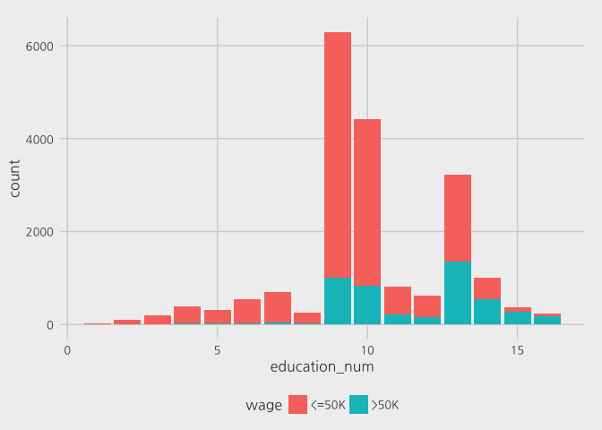

R 분류분석 : 중산층 여부 예측하기
================

2017 . 10 . 02

'따라하며 배우는 데이터과학'책의 8장 내용을 정리한 것입니다.

UCI 머신러닝 예제 데이터 아카이브의 'Adult'데이터를 사용하였다.(<https://goo.gl/yVK0qq>)

13개의 설명변수에 근거해서 연소득이 $50k가 넘는지(중산층 여부) 예측하기

### - 순서

#### 1. 데이터 로드와 데이터 구조 파악하기

#### 2. 훈련, 검증, 테스트세트로 분할

#### 3. 시각화로 데이터 탐색하기 EDA

##### 1) 나이(age)와 중산층 여부(wage)의 관계

##### 2) 인종, 성별, 나이 세 변수와 중산층 여부의 관계

##### 3) 총 교육기간과 중산층 여부의 관계

#### 4. 모형적합 - 로지스틱 회귀

#### 5. glm로지스틱회귀모형으로 예측하기

``` r
library(dplyr)
```

    ## Warning: package 'dplyr' was built under R version 3.4.2

    ## 
    ## Attaching package: 'dplyr'

    ## The following objects are masked from 'package:stats':
    ## 
    ##     filter, lag

    ## The following objects are masked from 'package:base':
    ## 
    ##     intersect, setdiff, setequal, union

``` r
library(ggplot2)
library(ISLR)
library(MASS)
```

    ## 
    ## Attaching package: 'MASS'

    ## The following object is masked from 'package:dplyr':
    ## 
    ##     select

``` r
library(glmnet)
```

    ## Warning: package 'glmnet' was built under R version 3.4.2

    ## Loading required package: Matrix

    ## Loading required package: foreach

    ## Loaded glmnet 2.0-13

``` r
library(randomForest)
```

    ## randomForest 4.6-12

    ## Type rfNews() to see new features/changes/bug fixes.

    ## 
    ## Attaching package: 'randomForest'

    ## The following object is masked from 'package:dplyr':
    ## 
    ##     combine

    ## The following object is masked from 'package:ggplot2':
    ## 
    ##     margin

``` r
library(gbm)
```

    ## Loading required package: survival

    ## Loading required package: lattice

    ## Loading required package: splines

    ## Loading required package: parallel

    ## Loaded gbm 2.1.3

``` r
library(rpart)
library(boot)
```

    ## 
    ## Attaching package: 'boot'

    ## The following object is masked from 'package:lattice':
    ## 
    ##     melanoma

    ## The following object is masked from 'package:survival':
    ## 
    ##     aml

### 1. 데이터 로드와 데이터 구조 파악하기

#### R에 데이터 파일을 읽어 들이고 변수명을 지정하기

(strip.white = TRUE 옵션은 데이터 파일에서 콤마 다음의 공백문자를 제거한다.)

``` r
setwd("/Users/jang-eun-a/stat-methods")
adult <- read.csv("adult.data.csv", header = FALSE, strip.white = TRUE)
names(adult) <- c('age', 'workclass', 'fnlwgt', 'education',
                  'education_num', 'merital_status', 'occupation',
                  'relationship', 'race', 'sex', 'capital_gain', 'capital_loss', 
                  'hours_per_week', 'native_country', 'wage')
```

그리고 glimpse() 명령으로 데이터 구조를 살펴보자

``` r
glimpse(adult)
```

    ## Observations: 32,561
    ## Variables: 15
    ## $ age            <int> 39, 50, 38, 53, 28, 37, 49, 52, 31, 42, 37, 30,...
    ## $ workclass      <fctr> State-gov, Self-emp-not-inc, Private, Private,...
    ## $ fnlwgt         <int> 77516, 83311, 215646, 234721, 338409, 284582, 1...
    ## $ education      <fctr> Bachelors, Bachelors, HS-grad, 11th, Bachelors...
    ## $ education_num  <int> 13, 13, 9, 7, 13, 14, 5, 9, 14, 13, 10, 13, 13,...
    ## $ merital_status <fctr> Never-married, Married-civ-spouse, Divorced, M...
    ## $ occupation     <fctr> Adm-clerical, Exec-managerial, Handlers-cleane...
    ## $ relationship   <fctr> Not-in-family, Husband, Not-in-family, Husband...
    ## $ race           <fctr> White, White, White, Black, Black, White, Blac...
    ## $ sex            <fctr> Male, Male, Male, Male, Female, Female, Female...
    ## $ capital_gain   <int> 2174, 0, 0, 0, 0, 0, 0, 0, 14084, 5178, 0, 0, 0...
    ## $ capital_loss   <int> 0, 0, 0, 0, 0, 0, 0, 0, 0, 0, 0, 0, 0, 0, 0, 0,...
    ## $ hours_per_week <int> 40, 13, 40, 40, 40, 40, 16, 45, 50, 40, 80, 40,...
    ## $ native_country <fctr> United-States, United-States, United-States, U...
    ## $ wage           <fctr> <=50K, <=50K, <=50K, <=50K, <=50K, <=50K, <=50...

분석 목표는 다른 변수들을 사용해 마지막 변수 wage를 예측하는것

``` r
summary(adult)
```

    ##       age                   workclass         fnlwgt       
    ##  Min.   :17.00   Private         :22696   Min.   :  12285  
    ##  1st Qu.:28.00   Self-emp-not-inc: 2541   1st Qu.: 117827  
    ##  Median :37.00   Local-gov       : 2093   Median : 178356  
    ##  Mean   :38.58   ?               : 1836   Mean   : 189778  
    ##  3rd Qu.:48.00   State-gov       : 1298   3rd Qu.: 237051  
    ##  Max.   :90.00   Self-emp-inc    : 1116   Max.   :1484705  
    ##                  (Other)         :  981                    
    ##         education     education_num                 merital_status 
    ##  HS-grad     :10501   Min.   : 1.00   Divorced             : 4443  
    ##  Some-college: 7291   1st Qu.: 9.00   Married-AF-spouse    :   23  
    ##  Bachelors   : 5355   Median :10.00   Married-civ-spouse   :14976  
    ##  Masters     : 1723   Mean   :10.08   Married-spouse-absent:  418  
    ##  Assoc-voc   : 1382   3rd Qu.:12.00   Never-married        :10683  
    ##  11th        : 1175   Max.   :16.00   Separated            : 1025  
    ##  (Other)     : 5134                   Widowed              :  993  
    ##            occupation           relationship                   race      
    ##  Prof-specialty :4140   Husband       :13193   Amer-Indian-Eskimo:  311  
    ##  Craft-repair   :4099   Not-in-family : 8305   Asian-Pac-Islander: 1039  
    ##  Exec-managerial:4066   Other-relative:  981   Black             : 3124  
    ##  Adm-clerical   :3770   Own-child     : 5068   Other             :  271  
    ##  Sales          :3650   Unmarried     : 3446   White             :27816  
    ##  Other-service  :3295   Wife          : 1568                             
    ##  (Other)        :9541                                                    
    ##      sex         capital_gain    capital_loss    hours_per_week 
    ##  Female:10771   Min.   :    0   Min.   :   0.0   Min.   : 1.00  
    ##  Male  :21790   1st Qu.:    0   1st Qu.:   0.0   1st Qu.:40.00  
    ##                 Median :    0   Median :   0.0   Median :40.00  
    ##                 Mean   : 1078   Mean   :  87.3   Mean   :40.44  
    ##                 3rd Qu.:    0   3rd Qu.:   0.0   3rd Qu.:45.00  
    ##                 Max.   :99999   Max.   :4356.0   Max.   :99.00  
    ##                                                                 
    ##        native_country     wage      
    ##  United-States:29170   <=50K:24720  
    ##  Mexico       :  643   >50K : 7841  
    ##  ?            :  583                
    ##  Philippines  :  198                
    ##  Germany      :  137                
    ##  Canada       :  121                
    ##  (Other)      : 1709

데이터 구조 파악 결과 절반 정도의 설명변수는 범주형 변수임을 알 수 있다.

반응변수의 변수형 알아보기  
factor 타입으로 "&lt;=50k"와 "&gt;50k"의 레벨을 가지고 있으며 각 레벨은 내부적으로 수치값 1과 2에 대응한다.

``` r
levels(adult$wage)
```

    ## [1] "<=50K" ">50K"

### 2. 훈련, 검증, 테스트세트로 분할

60:20:20

``` r
set.seed(1002)
n <- nrow(adult)
idx <- 1:n
training_idx <- sample(idx, n * .60)
idx <- setdiff(idx, training_idx)
validate_idx = sample(idx, n * .20)
test_idx <- setdiff(idx, validate_idx)
length(training_idx)
```

    ## [1] 19536

``` r
length(validate_idx)
```

    ## [1] 6512

``` r
length(test_idx)
```

    ## [1] 6513

``` r
training <- adult[training_idx, ]
validation <- adult[validate_idx, ]
test <- adult[test_idx, ]
```

### 3. 시각화로 데이터 탐색하기 EDA

#### 1) 나이(age)와 중산층 여부(wage)의 관계

``` r
training %>%
  ggplot(aes(age, fill=wage)) +
  geom_density(alpha=.5)
```

 - 20 ~ 25세 사이에는 거의 중산층인 사람들이 없다. - 파란 영역(중산층)은 25세 이훼 꾸준히 증가하여 30대 초반에는 반 이상의 사람이 중산층 이상의 수입을 얻는 것을 볼 수 있다. 이후엔 점점 감소하는 추세. - 즉, 중산층 이상의 수입 여부와 나이의 관계는 선형적이지 않다.

#### 2) 인종, 성별, 나이 세 변수와 중산층 여부의 관계

``` r
training %>%
  filter(race %in% c('Black','White')) %>%
  ggplot(aes(age, fill=wage)) +
  geom_density(alpha = .5) +
  ylim(0, 0.1) +
  facet_grid(race ~ sex, scales = 'free_y')
```

 - 나이-중산층 여부의 관계가 남성인 경우에 흑인이나 백인이나 유사하다. - 하지만 여성일 경우, 흑인의 경우 중장년층에서만 중산층의 비율이 높고 노년층의 경우에는 대부분 소득이 낮은 것을 볼 수 있다. - 백인 여성의 경우는 28~70세 동안에 &gt;50k 비율이 높지만, 흑인 여성의 경우에는 그 연령대가 32~55세 정도에 불과하다.

#### 3) 총 교육기간과 중산층 여부의 관계

``` r
training %>%
  ggplot(aes(education_num, fill=wage)) +
  geom_bar()
```

 당연한 결과로 education\_num이 증가할수록 중산층 비율이 높아짐을 확인할 수 있다.

### 4. 모형적합 - 로지스틱 회귀

모든 설명변수를 사용해서 로지스틱 회귀 모형에 넣어본다.

``` r
ad_glm_full <- glm(wage ~ . , data=training, family = binomial)
```

    ## Warning: glm.fit: fitted probabilities numerically 0 or 1 occurred

여기서 경고 메세지가 뜨는 이유 : 일부 설명변수의 조합에서 반응변수가 완벽하게 0이거나 1일 경우가 있기 때문이다.

##### 해결방법

-   glmnet 같은 정규화된 모형(regularized model)을 사용한다.
-   모형을 변경한다. 변수선택을 시도한다. 범주형 변수의 경우에는 레벨을 줄여본다.
-   베이지안 분석을 한다.
-   내버려둔다. 신회구간은 왜곡되지만 모형 자체는 쓸만 할 수 있다.

#### 적합된 모형 살펴보기

적합된 모형에서 어떤 변수들이 통계적으로 유의하게 나타나는지를 살펴보자.

``` r
summary(ad_glm_full)
```

    ## 
    ## Call:
    ## glm(formula = wage ~ ., family = binomial, data = training)
    ## 
    ## Deviance Residuals: 
    ##     Min       1Q   Median       3Q      Max  
    ## -3.2464  -0.5026  -0.1787  -0.0006   3.4507  
    ## 
    ## Coefficients: (2 not defined because of singularities)
    ##                                            Estimate Std. Error z value
    ## (Intercept)                              -8.280e+00  6.011e-01 -13.775
    ## age                                       2.683e-02  2.149e-03  12.482
    ## workclassFederal-gov                      1.190e+00  1.984e-01   6.001
    ## workclassLocal-gov                        4.468e-01  1.808e-01   2.471
    ## workclassNever-worked                    -9.184e+00  1.644e+03  -0.006
    ## workclassPrivate                          5.970e-01  1.607e-01   3.715
    ## workclassSelf-emp-inc                     8.248e-01  1.944e-01   4.243
    ## workclassSelf-emp-not-inc                 1.334e-01  1.754e-01   0.761
    ## workclassState-gov                        2.238e-01  1.961e-01   1.141
    ## workclassWithout-pay                     -1.438e+01  7.535e+02  -0.019
    ## fnlwgt                                    5.263e-07  2.272e-07   2.316
    ## education11th                             2.614e-01  2.737e-01   0.955
    ## education12th                             6.438e-01  3.453e-01   1.864
    ## education1st-4th                         -4.697e-01  6.313e-01  -0.744
    ## education5th-6th                          9.216e-02  4.156e-01   0.222
    ## education7th-8th                         -7.584e-01  3.308e-01  -2.293
    ## education9th                              1.103e-01  3.275e-01   0.337
    ## educationAssoc-acdm                       1.438e+00  2.359e-01   6.096
    ## educationAssoc-voc                        1.436e+00  2.271e-01   6.324
    ## educationBachelors                        2.063e+00  2.121e-01   9.728
    ## educationDoctorate                        3.128e+00  2.844e-01  10.998
    ## educationHS-grad                          8.694e-01  2.068e-01   4.204
    ## educationMasters                          2.329e+00  2.256e-01  10.321
    ## educationPreschool                       -1.922e+01  2.622e+02  -0.073
    ## educationProf-school                      2.862e+00  2.648e-01  10.809
    ## educationSome-college                     1.223e+00  2.096e-01   5.836
    ## education_num                                    NA         NA      NA
    ## merital_statusMarried-AF-spouse           1.886e+00  7.464e-01   2.527
    ## merital_statusMarried-civ-spouse          1.496e+00  3.986e-01   3.752
    ## merital_statusMarried-spouse-absent      -1.153e-02  3.075e-01  -0.037
    ## merital_statusNever-married              -4.785e-01  1.133e-01  -4.225
    ## merital_statusSeparated                  -7.240e-02  2.034e-01  -0.356
    ## merital_statusWidowed                     2.557e-01  1.922e-01   1.330
    ## occupationAdm-clerical                    4.226e-02  1.294e-01   0.326
    ## occupationArmed-Forces                   -1.422e+01  9.050e+02  -0.016
    ## occupationCraft-repair                    1.761e-01  1.099e-01   1.603
    ## occupationExec-managerial                 7.988e-01  1.138e-01   7.022
    ## occupationFarming-fishing                -1.011e+00  1.875e-01  -5.392
    ## occupationHandlers-cleaners              -5.249e-01  1.861e-01  -2.820
    ## occupationMachine-op-inspct              -1.260e-01  1.382e-01  -0.912
    ## occupationOther-service                  -7.758e-01  1.620e-01  -4.789
    ## occupationPriv-house-serv                -1.305e+01  2.200e+02  -0.059
    ## occupationProf-specialty                  5.955e-01  1.211e-01   4.916
    ## occupationProtective-serv                 5.548e-01  1.693e-01   3.276
    ## occupationSales                           2.951e-01  1.174e-01   2.514
    ## occupationTech-support                    8.003e-01  1.557e-01   5.139
    ## occupationTransport-moving                       NA         NA      NA
    ## relationshipNot-in-family                -1.147e-01  3.947e-01  -0.291
    ## relationshipOther-relative               -1.174e+00  3.758e-01  -3.123
    ## relationshipOwn-child                    -1.490e+00  4.091e-01  -3.641
    ## relationshipUnmarried                    -1.372e-01  4.119e-01  -0.333
    ## relationshipWife                          1.384e+00  1.334e-01  10.375
    ## raceAsian-Pac-Islander                    5.965e-01  3.426e-01   1.741
    ## raceBlack                                 3.991e-01  2.980e-01   1.339
    ## raceOther                                 8.491e-02  4.494e-01   0.189
    ## raceWhite                                 5.413e-01  2.833e-01   1.911
    ## sexMale                                   8.893e-01  1.027e-01   8.664
    ## capital_gain                              3.204e-04  1.335e-05  23.993
    ## capital_loss                              7.293e-04  4.816e-05  15.142
    ## hours_per_week                            3.151e-02  2.117e-03  14.885
    ## native_countryCambodia                    2.055e+00  8.773e-01   2.343
    ## native_countryCanada                      2.019e-01  3.873e-01   0.521
    ## native_countryChina                      -1.279e+00  5.239e-01  -2.441
    ## native_countryColumbia                   -1.978e+00  1.073e+00  -1.844
    ## native_countryCuba                       -1.236e-01  4.253e-01  -0.291
    ## native_countryDominican-Republic         -1.371e+01  2.740e+02  -0.050
    ## native_countryEcuador                     6.242e-01  8.421e-01   0.741
    ## native_countryEl-Salvador                -1.562e+00  9.986e-01  -1.564
    ## native_countryEngland                     1.983e-01  4.476e-01   0.443
    ## native_countryFrance                     -3.481e-03  7.700e-01  -0.005
    ## native_countryGermany                     5.961e-01  3.656e-01   1.631
    ## native_countryGreece                     -2.385e+00  9.518e-01  -2.506
    ## native_countryGuatemala                  -7.411e-01  1.005e+00  -0.737
    ## native_countryHaiti                       5.125e-02  1.190e+00   0.043
    ## native_countryHoland-Netherlands         -1.261e+01  2.400e+03  -0.005
    ## native_countryHonduras                   -8.778e-01  3.141e+00  -0.279
    ## native_countryHong                       -1.665e-01  7.653e-01  -0.218
    ## native_countryHungary                     1.031e-01  9.217e-01   0.112
    ## native_countryIndia                      -2.510e-01  4.298e-01  -0.584
    ## native_countryIran                       -4.819e-02  5.863e-01  -0.082
    ## native_countryIreland                     2.649e-01  7.467e-01   0.355
    ## native_countryItaly                       5.197e-01  4.129e-01   1.259
    ## native_countryJamaica                     4.034e-01  5.249e-01   0.769
    ## native_countryJapan                       1.387e-02  5.169e-01   0.027
    ## native_countryLaos                       -5.449e-01  1.156e+00  -0.471
    ## native_countryMexico                     -8.098e-01  3.532e-01  -2.293
    ## native_countryNicaragua                  -7.794e-01  1.101e+00  -0.708
    ## native_countryOutlying-US(Guam-USVI-etc) -1.469e+01  8.095e+02  -0.018
    ## native_countryPeru                       -1.524e+00  1.209e+00  -1.261
    ## native_countryPhilippines                 2.654e-01  3.681e-01   0.721
    ## native_countryPoland                     -2.024e-01  5.826e-01  -0.347
    ## native_countryPortugal                   -7.067e-01  1.081e+00  -0.654
    ## native_countryPuerto-Rico                -4.662e-01  4.902e-01  -0.951
    ## native_countryScotland                   -6.726e-01  1.264e+00  -0.532
    ## native_countrySouth                      -1.574e+00  6.628e-01  -2.375
    ## native_countryTaiwan                     -5.173e-02  6.718e-01  -0.077
    ## native_countryThailand                   -1.409e+00  1.264e+00  -1.115
    ## native_countryTrinadad&Tobago            -3.711e-01  9.017e-01  -0.412
    ## native_countryUnited-States               1.563e-01  1.757e-01   0.890
    ## native_countryVietnam                    -8.805e-01  7.701e-01  -1.143
    ## native_countryYugoslavia                  1.060e+00  8.636e-01   1.227
    ##                                          Pr(>|z|)    
    ## (Intercept)                               < 2e-16 ***
    ## age                                       < 2e-16 ***
    ## workclassFederal-gov                     1.97e-09 ***
    ## workclassLocal-gov                       0.013464 *  
    ## workclassNever-worked                    0.995542    
    ## workclassPrivate                         0.000203 ***
    ## workclassSelf-emp-inc                    2.21e-05 ***
    ## workclassSelf-emp-not-inc                0.446869    
    ## workclassState-gov                       0.253774    
    ## workclassWithout-pay                     0.984770    
    ## fnlwgt                                   0.020535 *  
    ## education11th                            0.339568    
    ## education12th                            0.062267 .  
    ## education1st-4th                         0.456908    
    ## education5th-6th                         0.824492    
    ## education7th-8th                         0.021852 *  
    ## education9th                             0.736273    
    ## educationAssoc-acdm                      1.09e-09 ***
    ## educationAssoc-voc                       2.54e-10 ***
    ## educationBachelors                        < 2e-16 ***
    ## educationDoctorate                        < 2e-16 ***
    ## educationHS-grad                         2.62e-05 ***
    ## educationMasters                          < 2e-16 ***
    ## educationPreschool                       0.941581    
    ## educationProf-school                      < 2e-16 ***
    ## educationSome-college                    5.35e-09 ***
    ## education_num                                  NA    
    ## merital_statusMarried-AF-spouse          0.011515 *  
    ## merital_statusMarried-civ-spouse         0.000175 ***
    ## merital_statusMarried-spouse-absent      0.970099    
    ## merital_statusNever-married              2.39e-05 ***
    ## merital_statusSeparated                  0.721836    
    ## merital_statusWidowed                    0.183383    
    ## occupationAdm-clerical                   0.744055    
    ## occupationArmed-Forces                   0.987468    
    ## occupationCraft-repair                   0.108928    
    ## occupationExec-managerial                2.19e-12 ***
    ## occupationFarming-fishing                6.97e-08 ***
    ## occupationHandlers-cleaners              0.004799 ** 
    ## occupationMachine-op-inspct              0.361937    
    ## occupationOther-service                  1.68e-06 ***
    ## occupationPriv-house-serv                0.952694    
    ## occupationProf-specialty                 8.85e-07 ***
    ## occupationProtective-serv                0.001051 ** 
    ## occupationSales                          0.011950 *  
    ## occupationTech-support                   2.77e-07 ***
    ## occupationTransport-moving                     NA    
    ## relationshipNot-in-family                0.771358    
    ## relationshipOther-relative               0.001789 ** 
    ## relationshipOwn-child                    0.000271 ***
    ## relationshipUnmarried                    0.739142    
    ## relationshipWife                          < 2e-16 ***
    ## raceAsian-Pac-Islander                   0.081680 .  
    ## raceBlack                                0.180566    
    ## raceOther                                0.850153    
    ## raceWhite                                0.056037 .  
    ## sexMale                                   < 2e-16 ***
    ## capital_gain                              < 2e-16 ***
    ## capital_loss                              < 2e-16 ***
    ## hours_per_week                            < 2e-16 ***
    ## native_countryCambodia                   0.019147 *  
    ## native_countryCanada                     0.602156    
    ## native_countryChina                      0.014660 *  
    ## native_countryColumbia                   0.065195 .  
    ## native_countryCuba                       0.771334    
    ## native_countryDominican-Republic         0.960104    
    ## native_countryEcuador                    0.458491    
    ## native_countryEl-Salvador                0.117727    
    ## native_countryEngland                    0.657733    
    ## native_countryFrance                     0.996393    
    ## native_countryGermany                    0.102980    
    ## native_countryGreece                     0.012204 *  
    ## native_countryGuatemala                  0.461103    
    ## native_countryHaiti                      0.965646    
    ## native_countryHoland-Netherlands         0.995807    
    ## native_countryHonduras                   0.779863    
    ## native_countryHong                       0.827747    
    ## native_countryHungary                    0.910928    
    ## native_countryIndia                      0.559263    
    ## native_countryIran                       0.934500    
    ## native_countryIreland                    0.722730    
    ## native_countryItaly                      0.208108    
    ## native_countryJamaica                    0.442177    
    ## native_countryJapan                      0.978590    
    ## native_countryLaos                       0.637429    
    ## native_countryMexico                     0.021847 *  
    ## native_countryNicaragua                  0.478804    
    ## native_countryOutlying-US(Guam-USVI-etc) 0.985522    
    ## native_countryPeru                       0.207362    
    ## native_countryPhilippines                0.470981    
    ## native_countryPoland                     0.728258    
    ## native_countryPortugal                   0.513317    
    ## native_countryPuerto-Rico                0.341516    
    ## native_countryScotland                   0.594508    
    ## native_countrySouth                      0.017532 *  
    ## native_countryTaiwan                     0.938628    
    ## native_countryThailand                   0.264845    
    ## native_countryTrinadad&Tobago            0.680669    
    ## native_countryUnited-States              0.373587    
    ## native_countryVietnam                    0.252875    
    ## native_countryYugoslavia                 0.219823    
    ## ---
    ## Signif. codes:  0 '***' 0.001 '**' 0.01 '*' 0.05 '.' 0.1 ' ' 1
    ## 
    ## (Dispersion parameter for binomial family taken to be 1)
    ## 
    ##     Null deviance: 21608  on 19535  degrees of freedom
    ## Residual deviance: 12243  on 19437  degrees of freedom
    ## AIC: 12441
    ## 
    ## Number of Fisher Scoring iterations: 15

출력 결과에 의하면 다음 변수가 특히 유의미한 것으로 확인된다.

-   age
-   workclass
-   fnlwgt
-   education
-   occupation
-   relationship - wife
-   race 등

### 5. glm로지스틱회귀모형으로 예측하기

검증세트에서의 에러확률을 살펴보기. 일단 반응변수와 예측변수를 추출한다.

``` r
y_obs <- ifelse(validation$wage == ">50K", 1, 0)
yhat_lm <- predict(ad_glm_full, newdata=validation, type='response')
```

    ## Warning in predict.lm(object, newdata, se.fit, scale = 1, type =
    ## ifelse(type == : prediction from a rank-deficient fit may be misleading

``` r
library(gridExtra)
```

    ## 
    ## Attaching package: 'gridExtra'

    ## The following object is masked from 'package:randomForest':
    ## 
    ##     combine

    ## The following object is masked from 'package:dplyr':
    ## 
    ##     combine

``` r
p1 <- ggplot(data.frame(y_obs, yhat_lm),
             aes(y_obs, yhat_lm, group=y_obs,
                 fill=factor(y_obs))) +
  geom_boxplot()
p2 <- ggplot(data.frame(y_obs, yhat_lm),
             aes(yhat_lm, fill=factor(y_obs))) + 
  geom_density(alpha=.5)
grid.arrange(p1,p2,ncol=2)
```


#### ROC 곡선 그려보기

``` r
# # install.packages("ROCR")
# library(ROCR)
# pred_lm <- prediction(y_obs, yhat_lm)
# perf_lm <- performance(pred_lm, measure = "tpr", x.measure = "fpr")
# plot(perf_lm, col='black', main="ROC Curve for GLM")
# abline(0,1)
# performance(pred_lm, "auc")@y.values[[1]]
#
#
##Error in UseMethod("predict") : 클래스 "c('double', 'numeric')"의 객체에 적용된 'predict'에 사용할수 있는 메소드가 없습니다
```

위의 에러를 해결하지 못하였다. 그래서 다른 패키지의 ROC그래프 함수를 사용하였다.

``` r
# install.packages("Epi")
library(Epi)
```

    ## 
    ## Attaching package: 'Epi'

    ## The following object is masked from 'package:base':
    ## 
    ##     merge.data.frame

``` r
a1=ROC(yhat_lm,y_obs, plot="ROC", main="ROC Curve for GLM" )
```


